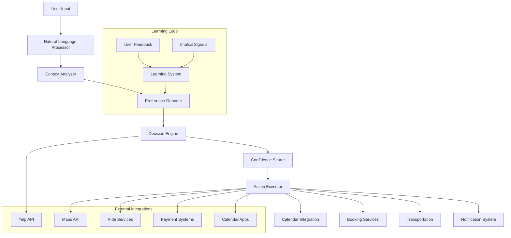

# Design Document

## Overview

The Autonomous Decision Engine represents a paradigm shift from recommendation systems to true AI autonomy. Rather than overwhelming users with choices, this system acts as a personal AI assistant that learns preferences, makes confident decisions, and executes actions automatically. The architecture emphasizes machine learning, contextual awareness, and seamless integration to create an experience where users simply state their needs and the AI handles everything else.

## Architecture

### High-Level Architecture



### Technology Stack

- **Backend**: Node.js with Express for API services
- **AI/ML**: TensorFlow.js for preference learning and decision modeling
- **Database**: PostgreSQL for user data, MongoDB for behavioral analytics
- **Real-time**: WebSocket connections for live decision updates
- **Integrations**: REST APIs for external services (Yelp, Google, Uber, etc.)
- **Frontend**: Next.js 14 with real-time updates and minimal UI
- **Deployment**: Kubernetes for scalable microservices architecture

### Core Microservices

1. **Decision Engine Service**: Core autonomous decision-making logic
2. **Learning Service**: Preference modeling and behavioral analysis
3. **Context Service**: Real-time context analysis (location, weather, calendar)
4. **Action Service**: Booking, coordination, and external integrations
5. **Notification Service**: Multi-channel communication management

## Components and Interfaces

### Core Decision Engine

```typescript
interface DecisionRequest {
  userId: string;
  query: string;
  context: UserContext;
  urgency?: 'immediate' | 'planned' | 'flexible';
}

interface DecisionResponse {
  choice: Experience;
  confidence: number; // 0-100
  reasoning: string[];
  executionPlan: ActionPlan;
  overrideWindow: number; // seconds
}

interface Experience {
  type: 'dining' | 'entertainment' | 'travel' | 'activity';
  venue: Venue;
  timing: TimeSlot;
  arrangements: Arrangement[];
}
```

### Preference Genome System

```typescript
interface PreferenceGenome {
  userId: string;
  corePreferences: CorePreferences;
  behavioralPatterns: BehavioralPattern[];
  contextualAdaptations: ContextualRule[];
  noveltyTolerance: number; // 0-1
  lastUpdated: Date;
  confidenceLevel: number;
}

interface CorePreferences {
  cuisine: WeightedPreference[];
  priceRange: PricePreference;
  atmosphere: AtmospherePreference;
  timing: TimingPreference;
  location: LocationPreference;
}

interface BehavioralPattern {
  pattern: string;
  frequency: number;
  contexts: string[];
  satisfaction: number; // -1 to 1
  recency: Date;
}
```

### Context Analysis System

```typescript
interface UserContext {
  temporal: TemporalContext;
  environmental: EnvironmentalContext;
  social: SocialContext;
  personal: PersonalContext;
}

interface TemporalContext {
  currentTime: Date;
  dayOfWeek: string;
  season: string;
  upcomingEvents: CalendarEvent[];
  recentActivity: Activity[];
}

interface EnvironmentalContext {
  location: GeoLocation;
  weather: WeatherCondition;
  localEvents: LocalEvent[];
  crowdLevels: CrowdData;
}
```

### Action Execution System

```typescript
interface ActionPlan {
  primaryAction: BookingAction;
  supportingActions: SupportingAction[];
  fallbackActions: FallbackAction[];
  timeline: ExecutionTimeline;
}

interface BookingAction {
  type: 'restaurant' | 'activity' | 'transportation';
  service: ExternalService;
  parameters: BookingParameters;
  expectedDuration: number;
}

interface ExecutionTimeline {
  overrideDeadline: Date;
  bookingTime: Date;
  confirmationTime: Date;
  reminderTimes: Date[];
}
```

## Data Models

### User Profile and Learning

```typescript
interface UserProfile {
  id: string;
  preferences: PreferenceGenome;
  boundaries: UserBoundaries;
  integrations: ServiceIntegrations;
  autonomyLevel: AutonomyLevel;
  createdAt: Date;
  lastActive: Date;
}

interface UserBoundaries {
  maxSpending: SpendingLimit[];
  dietaryRestrictions: string[];
  timeConstraints: TimeConstraint[];
  locationLimits: GeoBoundary[];
  blacklistedVenues: string[];
}

interface ServiceIntegrations {
  calendar: CalendarIntegration;
  payment: PaymentIntegration;
  transportation: TransportIntegration;
  communication: CommunicationIntegration;
}
```

### Decision and Learning Models

```typescript
interface DecisionRecord {
  id: string;
  userId: string;
  query: string;
  context: UserContext;
  decision: DecisionResponse;
  execution: ExecutionResult;
  feedback: UserFeedback;
  outcome: OutcomeMetrics;
  timestamp: Date;
}

interface LearningSignal {
  userId: string;
  signalType: 'explicit' | 'implicit' | 'behavioral';
  strength: number; // -1 to 1
  context: string[];
  timestamp: Date;
  source: string;
}
```

## Correctness Properties

*A property is a characteristic or behavior that should hold true across all valid executions of a system-essentially, a formal statement about what the system should do. Properties serve as the bridge between human-readable specifications and machine-verifiable correctness guarantees.*

### Property Reflection

After analyzing all acceptance criteria, several properties can be consolidated:

- Properties related to decision presentation (2.1, 2.2, 2.4) can be unified into a single choice presentation property
- Properties about learning and adaptation (1.5, 4.1, 4.2, 4.5) can be combined into a comprehensive learning property
- Properties about automation and coordination (3.1, 3.2, 3.3, 3.5) can be merged into an execution automation property
- Properties about context awareness (5.1, 5.2, 5.3, 5.4) can be consolidated into contextual decision-making
- Properties about confidence and transparency (6.1, 6.3, 6.4) can be unified into decision transparency

### Core Properties

**Property 1: Autonomous Decision Completeness**
*For any* minimal user input, the system should generate a complete decision including venue selection, timing, and booking details without requiring additional user input
**Validates: Requirements 1.1, 1.3**

**Property 2: Single Choice Presentation**
*For any* decision request, the system should present exactly one choice with confident language, never multiple options or tentative suggestions
**Validates: Requirements 2.1, 2.2, 2.4**

**Property 3: Automatic Execution and Coordination**
*For any* confirmed decision, the system should automatically handle all bookings, calendar integration, transportation coordination, and send a single comprehensive summary
**Validates: Requirements 3.1, 3.2, 3.3, 3.5**

**Property 4: Continuous Learning and Adaptation**
*For any* user feedback or behavioral signal, the system should update the preference model with appropriate temporal weighting and reflect changes in future decisions
**Validates: Requirements 1.5, 4.1, 4.2, 4.5**

**Property 5: Contextual Decision Making**
*For any* decision request, the system should incorporate current time, weather, location, calendar, and inferred mood to inform choices appropriately
**Validates: Requirements 5.1, 5.2, 5.3, 5.4**

**Property 6: Decision Transparency and Confidence**
*For any* decision made, the system should provide a confidence score (0-100%), highlight top 3 influencing factors, and handle low-confidence scenarios appropriately
**Validates: Requirements 6.1, 6.2, 6.3**

**Property 7: Boundary Enforcement and Safety**
*For any* decision or action, the system should respect user-defined spending limits, dietary restrictions, time constraints, and prioritize safety over preference optimization
**Validates: Requirements 8.2, 8.4**

**Property 8: Proactive Intelligence**
*For any* established user pattern, the system should proactively suggest relevant experiences with easy opt-out mechanisms and learn from acceptance/rejection patterns
**Validates: Requirements 9.1, 9.2, 9.4**

**Property 9: Novelty Balance**
*For any* well-established user preference profile, the system should introduce 10-20% novelty while maintaining core preference alignment and learning from novelty outcomes
**Validates: Requirements 10.1, 10.2, 10.3, 10.4**

**Property 10: Override and Control Mechanisms**
*For any* autonomous decision, the system should provide a 5-minute override window, switch to confirmation mode when requested, and learn from user corrections appropriately
**Validates: Requirements 8.1, 8.3, 8.5**

## Error Handling

### Decision Engine Failures
- **Low Confidence Scenarios**: When confidence < 70%, explain uncertainty and request feedback
- **No Suitable Options**: Automatically expand search criteria and explain limitations
- **Context Conflicts**: Prioritize safety and current context over historical preferences
- **Learning Failures**: Gracefully degrade to rule-based decisions while maintaining quality

### Integration Failures
- **Booking API Failures**: Automatically try alternative services and time slots
- **Calendar Integration Issues**: Proceed with booking but notify user of calendar sync failure
- **Payment Processing Errors**: Use backup payment methods or request user intervention
- **Transportation Coordination Failures**: Provide manual alternatives with clear instructions

### User Override and Boundary Violations
- **Spending Limit Exceeded**: Automatically find alternatives within budget
- **Dietary Restriction Conflicts**: Never compromise on dietary restrictions, find alternatives
- **Time Constraint Violations**: Respect time boundaries absolutely, adjust other preferences
- **Emergency Situations**: Override all preferences to prioritize user safety

## Testing Strategy

### Dual Testing Approach

**Unit Testing Focus:**
- Decision engine logic with various input scenarios
- Preference learning algorithms with synthetic feedback
- Context analysis with different environmental conditions
- Integration points with external services

**Property-Based Testing Focus:**
- Decision completeness across diverse user inputs
- Learning consistency with various feedback patterns
- Contextual adaptation under changing conditions
- Boundary enforcement with edge cases

### Property-Based Testing Framework

**Framework**: fast-check for TypeScript with custom generators
**Configuration**: Minimum 100 iterations per property test
**Test Tagging**: Each property-based test must include:
`**Feature: autonomous-decision-engine, Property {number}: {property_text}**`

### Smart Test Data Generation

**Decision Input Generators:**
- Natural language queries with varying specificity levels
- Context combinations (time, weather, location, calendar)
- User preference profiles with different maturity levels
- Boundary condition scenarios (spending limits, dietary restrictions)

**Learning Signal Generators:**
- Explicit feedback patterns (positive/negative/neutral)
- Implicit behavioral signals (visit duration, repeat visits)
- Temporal feedback patterns (immediate vs. delayed)
- Conflicting signal scenarios for robustness testing

**Integration Test Scenarios:**
- External API failure simulations
- Network latency and timeout conditions
- Concurrent user request handling
- Data consistency across microservices

### Performance and Scalability Testing

- **Decision Latency**: Sub-3-second response times for autonomous decisions
- **Learning Convergence**: Preference model stability within 10 interactions
- **Concurrent Users**: Support for 10,000+ simultaneous decision requests
- **Memory Efficiency**: Bounded memory usage for preference models

## Implementation Architecture

### Microservices Design

```
services/
├── decision-engine/
│   ├── src/
│   │   ├── core/
│   │   │   ├── decision-maker.ts     # Core decision logic
│   │   │   ├── confidence-scorer.ts  # Decision confidence calculation
│   │   │   └── reasoning-engine.ts   # Decision explanation generation
│   │   ├── models/
│   │   │   ├── preference-genome.ts  # User preference modeling
│   │   │   └── context-analyzer.ts   # Context processing
│   │   └── api/
│   │       └── decision-routes.ts    # REST API endpoints
├── learning-service/
│   ├── src/
│   │   ├── ml/
│   │   │   ├── preference-learner.ts # ML preference learning
│   │   │   ├── pattern-detector.ts   # Behavioral pattern analysis
│   │   │   └── novelty-engine.ts     # Novelty injection logic
│   │   └── feedback/
│   │       ├── signal-processor.ts   # Feedback signal processing
│   │       └── model-updater.ts      # Preference model updates
├── action-service/
│   ├── src/
│   │   ├── executors/
│   │   │   ├── booking-executor.ts   # Reservation handling
│   │   │   ├── calendar-executor.ts  # Calendar integration
│   │   │   └── transport-executor.ts # Transportation coordination
│   │   └── integrations/
│   │       ├── yelp-client.ts        # Yelp API integration
│   │       ├── calendar-client.ts    # Calendar API integration
│   │       └── payment-client.ts     # Payment processing
└── context-service/
    ├── src/
    │   ├── analyzers/
    │   │   ├── temporal-analyzer.ts   # Time-based context
    │   │   ├── location-analyzer.ts   # Location context
    │   │   └── mood-analyzer.ts       # Mood inference
    │   └── collectors/
    │       ├── weather-collector.ts   # Weather data
    │       └── event-collector.ts     # Local events data
```

### Database Design

**PostgreSQL (Structured Data):**
- User profiles and preferences
- Decision records and outcomes
- Service integrations and configurations
- Booking confirmations and history

**MongoDB (Behavioral Analytics):**
- Raw behavioral signals and patterns
- Context snapshots and analysis
- Learning model training data
- Real-time decision metrics

**Redis (Caching and Sessions):**
- Active decision sessions
- Frequently accessed preference data
- Real-time context cache
- Rate limiting and throttling

### Security and Privacy

**Data Protection:**
- End-to-end encryption for sensitive preference data
- Anonymized behavioral analytics with differential privacy
- Secure API key management for external integrations
- GDPR-compliant data retention and deletion policies

**Access Control:**
- OAuth 2.0 for user authentication
- Service-to-service authentication with JWT tokens
- Role-based access control for administrative functions
- Audit logging for all decision and learning activities

### Deployment and Scaling

**Container Orchestration:**
- Kubernetes deployment with auto-scaling
- Service mesh for inter-service communication
- Load balancing with health checks
- Blue-green deployment for zero-downtime updates

**Monitoring and Observability:**
- Real-time decision quality metrics
- Learning model performance tracking
- User satisfaction and engagement analytics
- System performance and error monitoring

This design creates a truly autonomous system that learns, decides, and acts on behalf of users, representing a fundamental advancement beyond traditional recommendation systems.