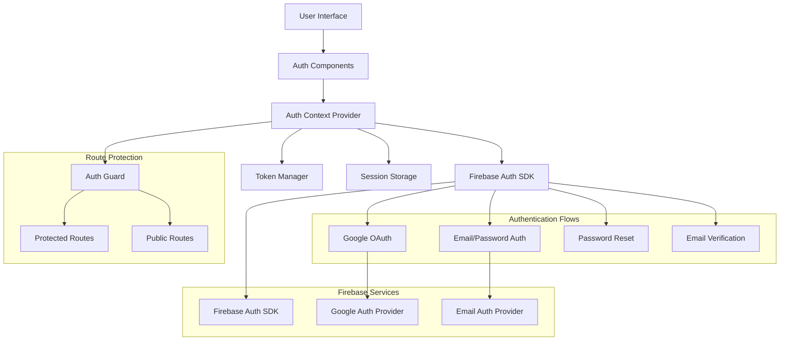

# Design Document

## Overview

The Firebase Authentication System provides a comprehensive, secure, and user-friendly authentication solution for modern web applications. Built on Firebase Authentication services, this system handles user registration, login, session management, and profile operations while maintaining high security standards and excellent user experience. The architecture emphasizes React integration, real-time state management, and robust error handling to create a seamless authentication flow.

## Architecture

### High-Level Architecture



### Technology Stack

- **Frontend**: React 18 with TypeScript for type safety
- **Authentication**: Firebase Authentication SDK v9+
- **State Management**: React Context API with useReducer
- **Styling**: Tailwind CSS with neo-brutalism design system
- **Form Handling**: React Hook Form with validation
- **Storage**: Browser localStorage for session persistence
- **Routing**: React Router v6 with protected routes

### Core Components

1. **AuthProvider**: Context provider managing global authentication state
2. **AuthGuard**: Route protection component for authenticated access
3. **LoginForm**: Email/password and OAuth login interface
4. **RegisterForm**: User registration with validation
5. **ProfileManager**: User profile viewing and editing
6. **PasswordReset**: Password reset flow management

## Components and Interfaces

### Authentication Context

```typescript
interface AuthContextType {
  user: User | null;
  loading: boolean;
  error: string | null;
  login: (email: string, password: string) => Promise<void>;
  register: (email: string, password: string) => Promise<void>;
  loginWithGoogle: () => Promise<void>;
  logout: () => Promise<void>;
  resetPassword: (email: string) => Promise<void>;
  updateProfile: (data: ProfileData) => Promise<void>;
  sendEmailVerification: () => Promise<void>;
}

interface User {
  uid: string;
  email: string | null;
  displayName: string | null;
  photoURL: string | null;
  emailVerified: boolean;
  createdAt: Date;
  lastLoginAt: Date;
}
```

### Authentication Components

```typescript
interface LoginFormProps {
  onSuccess?: () => void;
  redirectTo?: string;
  showGoogleAuth?: boolean;
}

interface RegisterFormProps {
  onSuccess?: () => void;
  redirectTo?: string;
  requireEmailVerification?: boolean;
}

interface AuthGuardProps {
  children: React.ReactNode;
  fallback?: React.ComponentType;
  requireEmailVerification?: boolean;
}

interface ProfileManagerProps {
  user: User;
  onUpdate?: (user: User) => void;
  allowEmailChange?: boolean;
  allowPasswordChange?: boolean;
}
```

### Form Validation Interfaces

```typescript
interface LoginFormData {
  email: string;
  password: string;
  rememberMe?: boolean;
}

interface RegisterFormData {
  email: string;
  password: string;
  confirmPassword: string;
  displayName?: string;
  acceptTerms: boolean;
}

interface ProfileUpdateData {
  displayName?: string;
  email?: string;
  currentPassword?: string;
  newPassword?: string;
}

interface ValidationRules {
  email: ValidationRule[];
  password: ValidationRule[];
  displayName: ValidationRule[];
}
```

## Data Models

### User Profile and Session

```typescript
interface UserProfile {
  uid: string;
  email: string;
  displayName: string | null;
  photoURL: string | null;
  emailVerified: boolean;
  phoneNumber: string | null;
  providerId: string;
  createdAt: Date;
  lastLoginAt: Date;
  customClaims?: Record<string, any>;
}

interface AuthSession {
  user: UserProfile;
  accessToken: string;
  refreshToken: string;
  expiresAt: Date;
  issuedAt: Date;
  provider: AuthProvider;
}

interface AuthState {
  user: UserProfile | null;
  loading: boolean;
  error: AuthError | null;
  initialized: boolean;
  sessionPersisted: boolean;
}
```

### Error Handling Models

```typescript
interface AuthError {
  code: string;
  message: string;
  userMessage: string;
  field?: string;
  timestamp: Date;
}

interface ValidationError {
  field: string;
  message: string;
  code: string;
}

interface FormErrors {
  email?: ValidationError;
  password?: ValidationError;
  confirmPassword?: ValidationError;
  displayName?: ValidationError;
  general?: AuthError;
}
```

## Correctness Properties

*A property is a characteristic or behavior that should hold true across all valid executions of a system-essentially, a formal statement about what the system should do. Properties serve as the bridge between human-readable specifications and machine-verifiable correctness guarantees.*

### Property Reflection

After analyzing all acceptance criteria, several properties can be consolidated to eliminate redundancy:

- Properties related to registration (1.1, 1.2, 1.3, 1.4) can be unified into a comprehensive registration property
- Properties about login and session management (2.1, 2.2, 6.1, 6.2) can be combined into authentication and session persistence
- Properties about OAuth (3.1, 3.2, 3.5) can be consolidated into OAuth integration
- Properties about password reset (4.1, 4.2, 4.3, 4.5) can be merged into password reset workflow
- Properties about profile management (5.1, 5.2, 5.3, 5.5) can be unified into profile operations
- Properties about route protection (7.1, 7.2, 7.3, 7.5) can be combined into authentication guard behavior
- Properties about logout (8.1, 8.2, 8.3, 8.4, 8.5) can be consolidated into logout operations
- Properties about email verification (9.1, 9.2, 9.3) can be unified into email verification workflow

### Core Properties

**Property 1: User Registration and Validation**
*For any* valid email and password combination, the system should successfully create a user account, automatically log them in, and handle validation errors appropriately for invalid inputs
**Validates: Requirements 1.1, 1.2, 1.3, 1.4, 1.5**

**Property 2: Authentication and Session Persistence**
*For any* valid user credentials, the system should authenticate the user, establish a persistent session, and automatically restore authentication state on return visits
**Validates: Requirements 2.1, 2.2, 2.5, 6.1, 6.2, 6.3**

**Property 3: OAuth Integration**
*For any* OAuth provider (Google), the system should initiate proper OAuth flow, handle successful authentication by creating or linking accounts, and manage OAuth-specific errors appropriately
**Validates: Requirements 3.1, 3.2, 3.5**

**Property 4: Password Reset Workflow**
*For any* password reset request, the system should send reset emails, provide secure password change forms, invalidate existing sessions after reset, and handle expired links properly
**Validates: Requirements 4.1, 4.2, 4.3, 4.5**

**Property 5: Profile Management Operations**
*For any* profile update request, the system should save changes securely, require appropriate verification for sensitive changes (email/password), and display current profile information correctly
**Validates: Requirements 5.1, 5.2, 5.3, 5.5**

**Property 6: Authentication Guard and Route Protection**
*For any* route access attempt, the system should properly enforce authentication requirements, redirect unauthenticated users, and update access permissions when authentication state changes
**Validates: Requirements 7.1, 7.2, 7.3, 7.5**

**Property 7: Logout Operations**
*For any* logout request, the system should immediately clear authentication sessions, remove all stored tokens, update all components to reflect unauthenticated state, and handle logout failures gracefully
**Validates: Requirements 8.1, 8.2, 8.3, 8.4, 8.5**

**Property 8: Email Verification Workflow**
*For any* user registration or email change, the system should send verification emails, properly verify emails when links are clicked, and enforce verification requirements for protected features
**Validates: Requirements 9.1, 9.2, 9.3**

**Property 9: Error Handling and User Feedback**
*For any* authentication error or invalid input, the system should display user-friendly error messages, provide specific validation guidance, and handle various error scenarios gracefully
**Validates: Requirements 2.3, 10.1, 10.4**

**Property 10: Offline and Network Resilience**
*For any* network connectivity issue, the system should maintain offline authentication state, handle token refresh failures gracefully, and provide appropriate user feedback for network-related issues
**Validates: Requirements 6.4, 6.5, 8.4**

## Error Handling

### Firebase Authentication Errors
- **Invalid Credentials**: Display generic "Invalid email or password" message for security
- **User Not Found**: Same generic message to prevent user enumeration
- **Email Already in Use**: Clear message with option to login instead
- **Weak Password**: Specific requirements and strength indicators
- **Network Errors**: Retry mechanisms with exponential backoff

### Form Validation Errors
- **Email Format**: Real-time validation with clear format requirements
- **Password Strength**: Progressive strength indicator with specific requirements
- **Confirmation Mismatch**: Immediate feedback when passwords don't match
- **Required Fields**: Clear indication of missing required information

### Session and Token Errors
- **Token Expiry**: Automatic refresh with fallback to re-authentication
- **Invalid Tokens**: Clear session and redirect to login
- **Storage Errors**: Graceful degradation with in-memory session management
- **Cross-tab Synchronization**: Real-time auth state sync across browser tabs

### OAuth Specific Errors
- **Provider Unavailable**: Fallback to email/password with clear messaging
- **Permission Denied**: Clear explanation of required permissions
- **Cancelled Flow**: Return to login without error messages
- **Account Linking Issues**: Clear guidance for account resolution

## Testing Strategy

### Dual Testing Approach

**Unit Testing Focus:**
- Form validation logic with various input combinations
- Authentication flow components with mocked Firebase
- Error handling scenarios with simulated failures
- Route protection logic with different authentication states

**Property-Based Testing Focus:**
- Registration workflows across diverse valid/invalid inputs
- Authentication persistence across various session scenarios
- OAuth flows with different provider responses
- Profile operations with various update combinations

### Property-Based Testing Framework

**Framework**: fast-check for JavaScript/TypeScript with Firebase mocking
**Configuration**: Minimum 100 iterations per property test
**Test Tagging**: Each property-based test must include:
`**Feature: firebase-auth, Property {number}: {property_text}**`

### Smart Test Data Generation

**Authentication Input Generators:**
- **Email Generators**: Valid emails, invalid formats, edge cases (long domains, special characters)
- **Password Generators**: Various strengths, special characters, length variations
- **Profile Data Generators**: Names with various character sets, optional fields
- **OAuth Response Generators**: Successful responses, error scenarios, cancelled flows

**Session State Generators:**
- **Token Generators**: Valid tokens, expired tokens, malformed tokens
- **User State Generators**: Various authentication states, verification statuses
- **Storage State Generators**: Different browser storage scenarios, quota limits

**Error Scenario Generators:**
- **Network Conditions**: Offline, slow connections, intermittent failures
- **Firebase Errors**: All documented Firebase Auth error codes
- **Validation Errors**: Various input validation failure scenarios

### Integration Testing

- **Firebase Integration**: Real Firebase project for integration testing
- **OAuth Provider Testing**: Test accounts for Google OAuth flows
- **Cross-browser Testing**: Authentication persistence across different browsers
- **Mobile Responsiveness**: Touch interactions and mobile-specific behaviors

## Implementation Architecture

### React Component Structure

```
src/
├── components/
│   ├── auth/
│   │   ├── AuthProvider.tsx          # Context provider
│   │   ├── AuthGuard.tsx             # Route protection
│   │   ├── LoginForm.tsx             # Login interface
│   │   ├── RegisterForm.tsx          # Registration interface
│   │   ├── ProfileManager.tsx        # Profile management
│   │   ├── PasswordReset.tsx         # Password reset flow
│   │   └── EmailVerification.tsx     # Email verification
│   └── ui/
│       ├── Button.tsx                # Neo-brutalism styled button
│       ├── Input.tsx                 # Form input components
│       ├── Card.tsx                  # Container components
│       └── Toast.tsx                 # Notification system
├── hooks/
│   ├── useAuth.tsx                   # Authentication hook
│   ├── useAuthForm.tsx               # Form handling hook
│   └── useAuthGuard.tsx              # Route protection hook
├── lib/
│   ├── firebase.ts                   # Firebase configuration
│   ├── auth-service.ts               # Authentication service layer
│   ├── validation.ts                 # Form validation rules
│   └── storage.ts                    # Session storage utilities
└── types/
    ├── auth.ts                       # Authentication type definitions
    ├── user.ts                       # User model types
    └── forms.ts                      # Form data types
```

### Firebase Configuration

```typescript
// lib/firebase.ts
import { initializeApp } from 'firebase/app';
import { getAuth, connectAuthEmulator } from 'firebase/auth';

const firebaseConfig = {
  apiKey: process.env.NEXT_PUBLIC_FIREBASE_API_KEY,
  authDomain: process.env.NEXT_PUBLIC_FIREBASE_AUTH_DOMAIN,
  projectId: process.env.NEXT_PUBLIC_FIREBASE_PROJECT_ID,
  storageBucket: process.env.NEXT_PUBLIC_FIREBASE_STORAGE_BUCKET,
  messagingSenderId: process.env.NEXT_PUBLIC_FIREBASE_MESSAGING_SENDER_ID,
  appId: process.env.NEXT_PUBLIC_FIREBASE_APP_ID,
};

const app = initializeApp(firebaseConfig);
export const auth = getAuth(app);

// Connect to emulator in development
if (process.env.NODE_ENV === 'development') {
  connectAuthEmulator(auth, 'http://localhost:9099');
}
```

### Authentication Service Layer

```typescript
// lib/auth-service.ts
import {
  createUserWithEmailAndPassword,
  signInWithEmailAndPassword,
  signInWithPopup,
  GoogleAuthProvider,
  sendPasswordResetEmail,
  updateProfile,
  sendEmailVerification,
  signOut,
} from 'firebase/auth';

export class AuthService {
  private googleProvider = new GoogleAuthProvider();

  async registerWithEmail(email: string, password: string) {
    const result = await createUserWithEmailAndPassword(auth, email, password);
    await sendEmailVerification(result.user);
    return result.user;
  }

  async loginWithEmail(email: string, password: string) {
    const result = await signInWithEmailAndPassword(auth, email, password);
    return result.user;
  }

  async loginWithGoogle() {
    const result = await signInWithPopup(auth, this.googleProvider);
    return result.user;
  }

  async resetPassword(email: string) {
    await sendPasswordResetEmail(auth, email);
  }

  async updateUserProfile(data: { displayName?: string; photoURL?: string }) {
    if (auth.currentUser) {
      await updateProfile(auth.currentUser, data);
    }
  }

  async logout() {
    await signOut(auth);
  }
}
```

### Neo-Brutalism Styled Components

Following the neo-brutalism design system, all authentication components will feature:

- **Bold 4px black borders** on all form elements
- **Strong shadows** with offset positioning for interactive elements
- **High contrast colors** with bright accent colors for CTAs
- **Bold typography** (font-weight 700+) for all text
- **Interactive feedback** through shadow and position changes
- **Geometric shapes** for buttons and containers

### Security Considerations

**Data Protection:**
- No sensitive data stored in localStorage (only session tokens)
- Automatic token refresh to minimize exposure window
- Secure HTTP-only cookies for additional token storage (if needed)
- Input sanitization for all user-provided data

**Authentication Security:**
- Firebase Security Rules for backend protection
- Email verification enforcement for sensitive operations
- Rate limiting through Firebase built-in protections
- Secure password requirements (8+ chars, mixed case, numbers, symbols)

**Session Management:**
- Automatic session cleanup on logout
- Cross-tab session synchronization
- Secure token storage with encryption
- Session timeout handling with graceful re-authentication

This design creates a robust, secure, and user-friendly authentication system that leverages Firebase's powerful authentication services while maintaining excellent user experience and security standards.