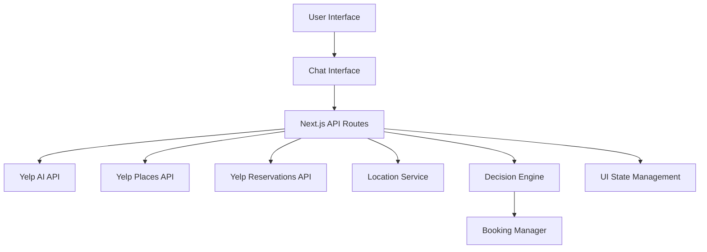

# Design Document

## Overview

Pick For Me is a Next.js web application that leverages Yelp's AI API to provide autonomous decision-making for dining and local experiences. The system eliminates choice paralysis by automatically selecting and booking the best option based on user preferences expressed through natural language. The architecture emphasizes simplicity, reliability, and seamless integration with Yelp's ecosystem while maintaining a 24-hour development timeline.

## Architecture

### High-Level Architecture



### Technology Stack

- **Frontend**: Next.js 14 with App Router, React 18, TypeScript
- **Styling**: Tailwind CSS for rapid UI development
- **State Management**: React Context + useReducer for conversation state
- **API Integration**: Next.js API routes for backend functionality
- **HTTP Client**: Fetch API with error handling and retry logic
- **Location Services**: Browser Geolocation API with manual fallback

### Deployment Architecture

- **Platform**: Vercel (optimized for Next.js)
- **Environment Variables**: Yelp API credentials, configuration settings
- **Static Assets**: Optimized images and fonts via Next.js optimization
- **API Routes**: Serverless functions for Yelp API integration

## Components and Interfaces

### Frontend Components

#### 1. ChatInterface Component
```typescript
interface ChatInterfaceProps {
  messages: Message[];
  onSendMessage: (message: string) => void;
  isLoading: boolean;
}
```
- Handles user input and conversation display
- Manages message history and loading states
- Provides responsive design for mobile and desktop

#### 2. RestaurantCard Component
```typescript
interface RestaurantCardProps {
  restaurant: Restaurant;
  onBook: (restaurant: Restaurant) => void;
  showBookingButton: boolean;
}
```
- Displays selected restaurant information
- Shows ratings, photos, hours, and contact details
- Integrates booking functionality

#### 3. LocationInput Component
```typescript
interface LocationInputProps {
  onLocationChange: (location: Location) => void;
  currentLocation: Location | null;
  isDetecting: boolean;
}
```
- Handles automatic location detection
- Provides manual location entry fallback
- Validates location data

### Backend API Interfaces

#### 1. Yelp AI API Integration
```typescript
interface YelpAIRequest {
  messages: ConversationMessage[];
  location?: {
    latitude: number;
    longitude: number;
  };
}

interface YelpAIResponse {
  message: string;
  businesses?: Business[];
  reservation_info?: ReservationInfo;
}
```

#### 2. Decision Engine Interface
```typescript
interface DecisionRequest {
  userPreferences: UserPreferences;
  location: Location;
  businesses: Business[];
}

interface DecisionResponse {
  selectedBusiness: Business;
  reasoning: string;
  alternatives?: Business[];
}
```

#### 3. Booking Manager Interface
```typescript
interface BookingRequest {
  business: Business;
  partySize: number;
  preferredTime: string;
  userContact: ContactInfo;
}

interface BookingResponse {
  success: boolean;
  confirmationId?: string;
  alternativeTimes?: string[];
  error?: string;
}
```

## Data Models

### Core Data Types

```typescript
interface User {
  id: string;
  preferences: UserPreferences;
  location: Location;
}

interface UserPreferences {
  cuisineTypes: string[];
  priceRange: PriceRange;
  dietaryRestrictions: string[];
  atmosphere: string;
  partySize: number;
}

interface Location {
  latitude: number;
  longitude: number;
  address: string;
  city: string;
  state: string;
}

interface Business {
  id: string;
  name: string;
  rating: number;
  priceRange: string;
  categories: string[];
  location: BusinessLocation;
  photos: string[];
  hours: BusinessHours[];
  phone: string;
  reservationUrl?: string;
}

interface ConversationMessage {
  id: string;
  role: 'user' | 'assistant';
  content: string;
  timestamp: Date;
  metadata?: {
    selectedBusiness?: Business;
    bookingInfo?: BookingInfo;
  };
}

interface BookingInfo {
  confirmationId: string;
  restaurantName: string;
  date: string;
  time: string;
  partySize: number;
  status: 'confirmed' | 'pending' | 'failed';
}
```

### State Management

```typescript
interface AppState {
  conversation: {
    messages: ConversationMessage[];
    isLoading: boolean;
    error: string | null;
  };
  user: {
    location: Location | null;
    preferences: UserPreferences;
  };
  selection: {
    currentBusiness: Business | null;
    alternatives: Business[];
    bookingStatus: BookingStatus;
  };
}
```
## Correctness Properties

*A property is a characteristic or behavior that should hold true across all valid executions of a system-essentially, a formal statement about what the system should do. Properties serve as the bridge between human-readable specifications and machine-verifiable correctness guarantees.*

### Property Reflection

After analyzing all acceptance criteria, several properties can be consolidated to eliminate redundancy:

- Properties 1.1 and 8.2 both deal with API communication and can be combined into a comprehensive API integration property
- Properties 4.1, 4.2, and 4.3 all relate to the booking process and can be unified into a booking workflow property
- Properties 5.1, 5.2, 5.3, and 5.5 all concern restaurant information display and can be combined
- Properties 6.1, 6.3, 6.4, and 6.5 all deal with error handling and can be consolidated

### Core Properties

**Property 1: Natural Language Processing and API Integration**
*For any* natural language query, the system should successfully process the input, extract user preferences, and communicate with Yelp AI API using proper authentication and data formatting
**Validates: Requirements 1.1, 1.2, 8.1, 8.2**

**Property 2: Conversation Context Preservation**
*For any* multi-turn conversation, the system should maintain context across messages and incorporate new information into the decision-making process
**Validates: Requirements 1.4**

**Property 3: Location Handling**
*For any* location input (automatic or manual), the system should validate coordinates, ensure they are within supported regions, and use them for business queries
**Validates: Requirements 2.2, 2.4, 2.5**

**Property 4: Decision Engine Selection**
*For any* set of user preferences and available businesses, the decision engine should automatically select the best match and provide reasoning for the choice
**Validates: Requirements 3.1, 3.2, 3.5**

**Property 5: Complete Information Display**
*For any* selected restaurant, the system should display all available information including business details, reviews, ratings, photos, and contact information in a properly formatted manner
**Validates: Requirements 5.1, 5.2, 5.3, 5.5**

**Property 6: Booking Workflow**
*For any* restaurant that supports reservations, the system should check availability, attempt booking when slots exist, and provide confirmation details or alternatives when booking fails
**Validates: Requirements 4.1, 4.2, 4.3, 4.4**

**Property 7: Error Handling and Recovery**
*For any* system error (API failures, network issues, invalid input), the system should provide appropriate error messages, suggest recovery actions, and maintain system stability
**Validates: Requirements 6.1, 6.3, 6.4, 6.5**

**Property 8: API Coordination**
*For any* operation requiring multiple Yelp APIs, the system should coordinate data between AI API, Places API, and Reservations API while handling rate limits and errors appropriately
**Validates: Requirements 8.3, 8.4, 8.5**

**Property 9: User Interface Responsiveness**
*For any* user interaction, the system should provide immediate visual feedback, maintain proper loading states, and display conversation history in chronological order
**Validates: Requirements 7.2, 7.5**

## Error Handling

### API Error Handling
- **Yelp API Failures**: Implement exponential backoff retry logic with maximum retry limits
- **Rate Limiting**: Implement request throttling and queue management
- **Authentication Errors**: Provide clear error messages and credential validation
- **Network Timeouts**: Set appropriate timeout values and provide fallback responses

### Location Service Errors
- **Permission Denied**: Gracefully fallback to manual location entry
- **Location Unavailable**: Provide clear instructions for manual input
- **Invalid Coordinates**: Validate and sanitize location data before API calls

### Booking Errors
- **Reservation Unavailable**: Offer alternative time slots or backup restaurants
- **Booking API Failures**: Provide manual booking contact information
- **Invalid Booking Data**: Validate all booking parameters before submission

### User Input Errors
- **Invalid Queries**: Provide helpful suggestions and examples
- **Ambiguous Requests**: Ask clarifying questions through conversational interface
- **Missing Information**: Guide users to provide necessary details

## Testing Strategy

### Dual Testing Approach

The testing strategy combines unit testing for specific scenarios with property-based testing for universal behaviors:

**Unit Testing Focus:**
- Specific API integration scenarios
- Error handling edge cases
- UI component behavior
- Location service functionality

**Property-Based Testing Focus:**
- Natural language processing across diverse inputs
- Decision engine behavior with various preference combinations
- API coordination under different conditions
- Error recovery across multiple failure scenarios

### Property-Based Testing Framework

**Framework**: fast-check for JavaScript/TypeScript
**Configuration**: Minimum 100 iterations per property test
**Test Tagging**: Each property-based test must include a comment with the format:
`**Feature: pick-for-me, Property {number}: {property_text}**`

### Testing Implementation Requirements

1. **API Integration Tests**: Mock Yelp API responses for consistent testing
2. **Location Service Tests**: Mock geolocation API for reliable testing
3. **Decision Engine Tests**: Test with various business data combinations
4. **Error Handling Tests**: Simulate different failure scenarios
5. **UI Component Tests**: Test responsive behavior and user interactions

### Test Data Generation

**Smart Generators for Property Testing:**
- **Natural Language Queries**: Generate realistic user requests with various preferences
- **Location Data**: Generate valid coordinates within supported regions
- **Business Data**: Create realistic restaurant information matching Yelp API format
- **User Preferences**: Generate diverse preference combinations for decision testing
- **API Responses**: Generate valid and invalid API response formats

### Performance Testing

- **API Response Times**: Ensure sub-2-second response times for decision making
- **Location Detection**: Test geolocation performance across different devices
- **UI Responsiveness**: Verify smooth interactions on mobile and desktop
- **Memory Usage**: Monitor memory consumption during extended conversations

## Implementation Architecture

### Next.js App Structure

```
src/
├── app/
│   ├── api/
│   │   ├── chat/route.ts          # Yelp AI API integration
│   │   ├── location/route.ts      # Location services
│   │   └── booking/route.ts       # Reservation handling
│   ├── components/
│   │   ├── ChatInterface.tsx      # Main conversation UI
│   │   ├── RestaurantCard.tsx     # Restaurant display
│   │   ├── LocationInput.tsx      # Location handling
│   │   └── LoadingStates.tsx      # UI feedback components
│   ├── lib/
│   │   ├── yelp-client.ts         # API client utilities
│   │   ├── decision-engine.ts     # Selection logic
│   │   └── types.ts               # TypeScript definitions
│   └── page.tsx                   # Main application page
```

### API Route Implementation

**Chat API Route** (`/api/chat`):
- Handles conversation with Yelp AI API
- Manages conversation context and state
- Implements decision engine logic
- Returns selected restaurant with reasoning

**Location API Route** (`/api/location`):
- Processes location detection and validation
- Handles manual location input
- Validates coordinates against supported regions

**Booking API Route** (`/api/booking`):
- Integrates with Yelp Reservations API
- Handles booking confirmation and failures
- Provides alternative options when needed

### State Management Strategy

**React Context + useReducer** for conversation state:
- Maintains message history
- Tracks user preferences
- Manages loading states
- Handles error states

**Local State** for UI components:
- Form inputs and validation
- Loading indicators
- Modal states

### Security Considerations

- **API Key Protection**: Store Yelp API credentials in environment variables
- **Input Sanitization**: Validate and sanitize all user inputs
- **Rate Limiting**: Implement client-side request throttling
- **Error Information**: Avoid exposing sensitive error details to users

This design provides a robust foundation for building Pick For Me within the 24-hour hackathon timeline while ensuring correctness, reliability, and user experience quality.